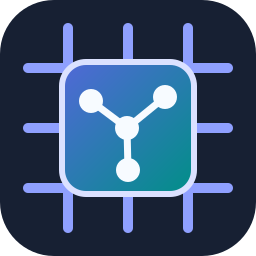

<div align="center">
  
  <h1>From Graph to NPU</h1>
  <p>A chapter-based guide and learning implementation for a RISC-V-hosted NPU software stack.</p>
  <p>
    <a href="https://buicongnguyen.github.io/NPU_sw_stack/">Read the book</a>
    ·
    <a href="https://github.com/buicongnguyen/NPU_sw_stack/actions/workflows/docs.yml">
      
    </a>
  </p>
</div>

## About

This repository explains and, over time, implements the complete path from a
small static neural-network graph to a simulated NPU controlled by a bare-metal
RV64 program in Spike:

```text
Static graph → compiler → command buffer → RV64 runtime → NPU model → evidence
```

The first application target is fixed-shape INT8 YOLOv8n detection. Primitive
integer arithmetic, GEMM, the native command device, compiler lowering, runtime
submission, convolution, a tiny CNN, and timing analysis are checkpoints on
that route. YOLO26, Transformer execution, and deformable convolution are later
comparison branches.

## Current status

**Documentation published; implementation verification deferred.**

The chapter book, architecture, and interface contracts are ready for review.
The source scaffold has received static logic/code review and source-level
remediation, but Linux builds, numerical tests, Spike integration, timing, and
RTL results are intentionally not claimed. Those gates will be run after the
WSL environment is configured.

Start with:

- [the online chapter book](https://buicongnguyen.github.io/NPU_sw_stack/);
- [the specification map](docs/specification-status.md);
- [the reorganization plan](docs/project/reorganization-plan.md);
- [the reorganization logic review](docs/project/reorganization-logic-review.md);
- [the static code review](docs/project/static-code-review-2026-07-28.md);
- [the post-deployment logic review](docs/project/post-deployment-logic-review-2026-07-28.md);
- [the post-deployment static code review](docs/project/post-deployment-code-review-2026-07-28.md);
- [the static remediation review](docs/project/static-remediation-review-2026-07-28.md);
- [the book content and logic review](docs/project/content-logic-review-2026-07-28.md);
- [the visual content review](docs/project/visual-content-review-2026-07-28.md).

## Book structure

The reading path moves from system boundaries and reproducible evidence through
integer arithmetic, GEMM, commands, compiler, runtime, CNN/YOLO deployment,
timing/RTL, and advanced research branches. Chapter introductions and review
questions live beside stable normative specifications and guided lessons.

The organization takes inspiration from HelloAlgo’s chapter-first learning
experience while using original prose, diagrams, identity, and project-specific
contracts.

## Repository map

```text
docs/chapter_*/    chapter introductions and reviews
docs/lessons/      future hands-on milestones
docs/project/      plans and review records
docs/_posts/       dated decisions and evidence journal
include/, src/     C++ numerical scaffold
python/            Python reference scaffold
tests/             future executable gates
scripts/           documentation and deferred implementation helpers
.github/           contribution templates and workflows
```

## Documentation development

Create a disposable Python environment and install the pinned site tools:

```powershell
python -m venv .venv-docs
./.venv-docs/Scripts/python -m pip install -r requirements-docs.txt
./scripts/check_docs.ps1
./.venv-docs/Scripts/python -m mkdocs serve
```

The production workflow additionally runs `mkdocs build --strict` and deploys
the generated site to GitHub Pages.

## Contributing and security

See [CONTRIBUTING.md](CONTRIBUTING.md) before opening a pull request and
[SECURITY.md](SECURITY.md) for private vulnerability reporting guidance. The
initial documentation release intentionally keeps implementation checks manual
until the declared Linux environment exists.

Citation metadata is available in [CITATION.cff](CITATION.cff).

## License status

No license has been selected yet. Copyright remains with the repository owner,
and no permission to reuse, modify, or redistribute the contents is granted
until a license file is added. External projects are cited for ideas and
references; their prose, code, assets, branding, and licenses are not copied
into this repository.
