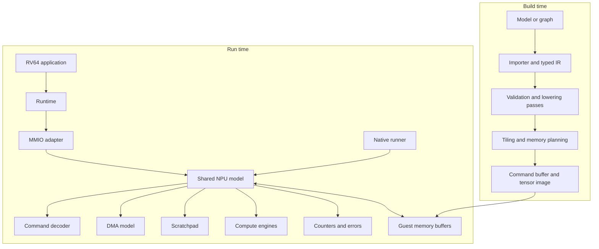

# Architecture walkthrough

Status: **reviewed explanation of the v1 design; implementation unverified**

This page explains the system from the model file down to simulated hardware.
It is the conceptual map for all later lessons.

Exact behavior is split across the
[specification map](specification-status.md). This page
does not override the numerical, command, memory/execution, or MMIO contracts.

## System overview



The native runner bypasses RV64 and Spike but invokes the same command decoder
and NPU model. That short path is essential for fast debugging.

## Component responsibilities

| Component | Owns | Must not own |
|---|---|---|
| Python reference | Mathematical truth and golden tensors | Device state or MMIO behavior |
| Compiler | Shapes, layouts, allocation, scheduling, byte emission | Executing commands |
| Runtime | Submission, fences, status, timeout, error decoding | Graph optimization |
| Spike adapter | MMIO and guest-memory translation | NPU arithmetic |
| NPU model | Command validation, memory effects, arithmetic, counters | Spike internals or ONNX parsing |
| Timing model | Estimated cycles, stalls, traffic, utilization | Functional output values |
| RTL | Small hardware truth source for selected blocks | Full application policy |

These boundaries prevent a convenient shortcut in one layer from becoming an
undocumented dependency in every other layer.

## Why Spike is useful

Spike is a functional RISC-V ISA simulator. It is useful here because it can
run the RV64 application and driver that control the simulated device. This
tests:

- RV64 compilation and linking
- Register-width and address handling
- MMIO reads and writes
- Memory-ordering fences
- Submission, polling, timeout, reset, and error paths
- Agreement between host-visible ABI documentation and code

Spike is not used as the NPU compute model. Its internal C++ API is also not a
stable public API, so the project pins a revision and confines Spike-specific
code to one adapter.

## Why MMIO before custom instructions

The first interface is a memory-mapped device with a doorbell:

```text
guest writes command/data buffers
-> guest executes a memory/I/O fence
-> guest writes command address and size
-> guest writes START
-> device validates and executes
-> guest polls STATUS
-> guest observes COMPLETE or ERROR
```

This mirrors a common accelerator control path and keeps large command
descriptors out of instruction operands. A custom instruction could later
replace the doorbell, but it would not remove the need for memory buffers,
validation, scheduling, or error handling.

## Proposed address spaces

Three address domains must be named explicitly:

| Domain | Meaning | Example user |
|---|---|---|
| Guest physical address | RV64-visible memory under Spike | Runtime and DMA adapter |
| NPU scratchpad offset | Byte offset inside on-device SRAM | Commands and allocator |
| Host pointer | Native simulator implementation detail | Native runner only |

A guest address must never be treated as a host pointer. Every translation is
range checked, and address-plus-size arithmetic is checked for overflow before
access.

## Version-one NPU

The initial device is deliberately small:

- 8x8 conceptual INT8 MAC array
- INT8 activations and weights
- INT32 accumulators
- 64 KiB byte-addressed scratchpad
- Explicit DMA load/store
- Bias, ReLU, and fixed-point requantization
- Static shapes and batch 1
- One in-flight command buffer, executed in order

The first command set is:

```text
DMA_LOAD
DMA_STORE
GEMM_I8_I8_I32
ADD_BIAS_I32
RELU_I32
REQUANTIZE_I32_I8
BARRIER
END
```

Convolution is initially lowered into supported matrix/tile work. Specialized
convolution, vector, reduction, or gather engines are additions justified by
measured workload gaps.

## Compiler path

The compiler is intentionally staged:

```text
input JSON or ONNX subset
-> validate schema/opset
-> infer static tensor shapes
-> normalize layouts
-> lower high-level operations
-> choose tiles
-> calculate tensor lifetimes
-> allocate scratchpad
-> schedule DMA and compute
-> encode binary commands
-> disassemble for review
```

Each pass has a typed input/output and an independent test. The binary emitter
does not make optimization decisions, and the disassembler must round-trip all
valid commands.

The first MLP fits as whole operations. Compiler tiling is introduced only when
an operation does not fit the v1 scratchpad; its deterministic loop and
allocation rules are defined in the
[compiler design](compiler-design.md).

## Runtime and device state

The minimal device state machine is:

```text
IDLE -> BUSY(validating/executing) -> COMPLETE
  ^             |                       |
  |             +--------------------> ERROR
  |                                      |
  +---------------- RESET ---------------+
```

Required rules:

- `START` outside `IDLE` is rejected as a platform access fault and leaves the
  current device state unchanged; it does not set a device `ERROR_CODE`.
- Completion and error are distinguishable.
- Error state records a stable code and command index.
- Reset returns all architecturally visible state to documented defaults.
- Polling always has a software timeout.
- Unknown command versions/opcodes fail before unchecked memory access.

Version one has a single submission slot rather than a ring queue. There is no
preemption or concurrent context. Memory ownership, validation atomicity,
command effects, and reset recovery are normative in the
[memory and execution model](memory-execution-model.md).

## Functional truth versus timing estimates

Command execution produces two outputs:

1. Functional state: tensor bytes, status, and errors.
2. Accounting state: MACs, bytes, and estimated cycles; utilization is derived.

Timing parameters may change the accounting state but must never change
functional output. Until selected operations are compared with RTL, all cycle
fields are named `estimated_cycles`. Stall categories belong to the later
timing-model trace and are not ABI 1.0 MMIO registers.

## Workload mapping

| Workload feature | Initial mapping |
|---|---|
| Dense/linear layer | GEMM on NPU |
| Ordinary Conv2D | Compiler lowering to tiled matrix work |
| Bias and ReLU | NPU post-operations |
| SiLU | Host/reference first; later approximation study |
| YOLO decode and NMS | RV64 host first |
| Transformer linear projections | GEMM on NPU |
| RMSNorm, RoPE, Softmax | FP32 host/reference first |
| Deformable sampling | FP32 host fallback first |

Fallback is not failure. Hidden fallback is failure. Reports must include its
time, operations, and transfer traffic.

## Trust chain

The comparison order is:

```text
hand-calculated scalar cases
-> NumPy reference
-> portable C++ model
-> native command runner
-> RV64/Spike path
-> analytical timing model
-> selected RTL blocks
```

When two levels disagree, report the first divergent boundary rather than only
the final output.

## Primary references

- [Spike](https://github.com/riscv-software-src/riscv-isa-sim)
- [Spike abstract device interface](https://github.com/riscv-software-src/riscv-isa-sim/blob/master/riscv/abstract_device.h)
- [RISC-V memory-ordering explanation](https://docs.riscv.org/reference/isa/unpriv/mm-eplan.html)
- [ONNX IR specification](https://onnx.ai/onnx/repo-docs/IR.html)
- [Gemmini](https://github.com/ucb-bar/gemmini)
- [NVDLA primer](https://nvdla.org/primer.html)

## Continue through the specification

Next specification: [Numerical contract](numerical-contract.md)
