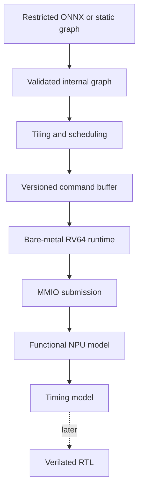

# Chapter 1: From graph to NPU

The system is easiest to understand as a chain of ownership. The graph defines
the requested computation, the compiler chooses a legal schedule, the runtime
controls submission, and the device model owns execution state.

## Learning goals

By the end of this chapter, you should be able to:

- identify the responsibility of every major layer;
- distinguish a data structure from a serialized interface;
- explain why one functional model serves native and Spike-hosted execution;
- locate the normative document for each important contract.

## Mental model

The command buffer and tensor memory are the narrow waist of the design. Layers
above may evolve without changing the device, and models below may grow more
detailed without changing the graph, provided those contracts remain stable.

## Reading path

1. Read the [architecture walkthrough](../architecture.md).
2. Compare it with the [reviewed design plan](../plan.md).
3. Use the [chapter review](review.md) to test boundary ownership.

!!! note "Implementation status"
    This chapter describes intended behavior. Static source review found no
    release-blocking documentation contradiction, but execution is deferred.
