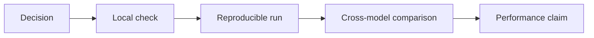

# Chapter 2: Reproducible truth

An experiment becomes useful when another person can identify the source
revision, environment, input, command, output, and interpretation. This chapter
defines that evidence discipline before complex accelerator behavior is added.

## Learning goals

- separate a design decision from an observed result;
- capture an immutable source revision and toolchain identity;
- understand the difference between a local check and reproducible evidence;
- establish a CPU baseline before assigning work to the NPU.

## Evidence ladder

Every step adds required metadata. A performance number without a correctness
gate and a reproducible command is not a project result.

## Reading path

1. Establish the intended baseline in
   [Lesson 00](../lessons/00-baseline.md).
2. Apply the [experiment and evidence method](../experiment-method.md).
3. Complete the [summary and review](review.md).

!!! warning "Deferred execution"
    No WSL, compiler, simulator, or performance result is claimed by this
    documentation release.
