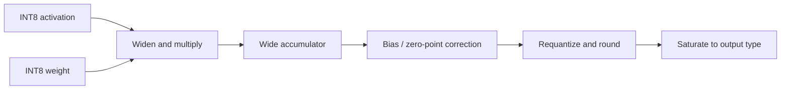

# Chapter 3: Exact integer inference

Integer inference is not merely “floating point with smaller storage.” Results
depend on widening, accumulation, scaling, rounding, saturation, and overflow
rules. Those choices must match across Python, C++, the compiler, and hardware.

## Learning goals

- trace an INT8 operation through a wider accumulator;
- distinguish quantization parameters from tensor data;
- explain why rounding and saturation order is normative;
- recognize boundary cases that require dedicated vectors.

## Numerical pipeline

The prose contract is the authority. Code is an implementation of that
contract, and discrepancies must be resolved explicitly.

## Reading path

1. Study the [numerical contract](../numerical-contract.md).
2. Work through the
   [integer inference lesson](../lessons/01-integer-inference.md).
3. Review the boundary cases in [this chapter’s questions](review.md).

!!! note "Static review finding"
    Extreme quantization boundaries need execution with sanitizers and
    cross-language vectors after WSL setup. The finding is tracked in the
    [static code review](../project/static-code-review-2026-07-28.md).
