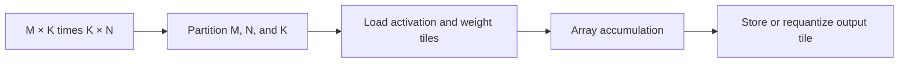

# Chapter 4: GEMM and the NPU core

Matrix multiplication is the first bridge from an exact arithmetic contract to
an accelerator-shaped execution model. A simple reference establishes truth;
tiling and array mapping then explain how work reaches the NPU.

## Learning goals

- express dense layers and convolutions in GEMM-shaped work;
- separate mathematical dimensions from tile dimensions;
- identify padding and partial-tile behavior;
- relate array utilization to the selected mapping.

## From matrix to tiles

Correctness must be independent of whether a dimension fills the physical
array. Performance, however, depends strongly on tile shape and reuse.

## Reading path

1. Complete the [GEMM and NPU lesson](../lessons/02-gemm-and-npu.md).
2. Revisit the numerical rules from
   [Chapter 3](../chapter_03_integer_inference/index.md).
3. Answer the [summary questions](review.md).
