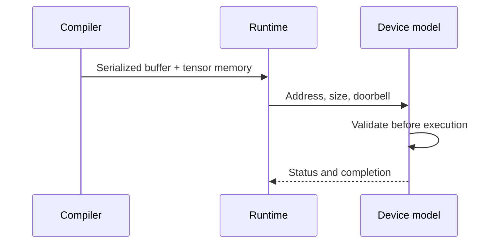

# Chapter 5: Commands and memory

The command stream is the stable handshake between compiler and device. The
memory model gives every referenced address a meaning and every operation an
ordering rule.

## Learning goals

- distinguish an in-memory object from its serialized representation;
- explain header, command, tensor, and payload validation;
- trace global-memory and scratchpad ownership;
- reason about bounds, alignment, overlap, and completion.

## Submission boundary

A malformed command must fail predictably before it can cause an out-of-bounds
access or partial execution.

## Reading path

1. Read the [command-buffer ABI](../command-abi.md).
2. Read the [memory and execution model](../memory-execution-model.md).
3. Build the hand-authored native path in the
   [commands and memory lesson](../lessons/03-commands-memory.md).
4. Check your understanding in the [chapter review](review.md).

!!! note "Normative boundary"
    Examples explain the format, but the versioned field definitions and
    validation rules are the source of truth.
