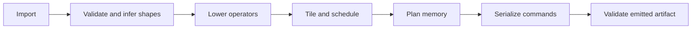

# Chapter 6: Compiler and scheduling

The compiler turns a validated static graph into legal work for the device. It
does not hide unsupported behavior: shape inference, lowering, layout, tiling,
allocation, and serialization each have an explicit failure boundary.

## Learning goals

- explain the stages between graph import and command emission;
- distinguish operator support from lowering support;
- trace shape and quantization metadata through the internal graph;
- understand why compiler study precedes runtime integration.

## Lowering pipeline

The compiler is placed before the runtime in this book because the runtime
needs a concrete, valid artifact to submit.

## Reading path

1. Study the [compiler design](../compiler-design.md).
2. Work through the [compiler lesson](../lessons/04-compiler.md).
3. Complete the [summary and review](review.md).

!!! warning "Scope"
    This is a deliberately small static compiler, not a general ONNX
    implementation. Unsupported shapes or operators must fail clearly.
