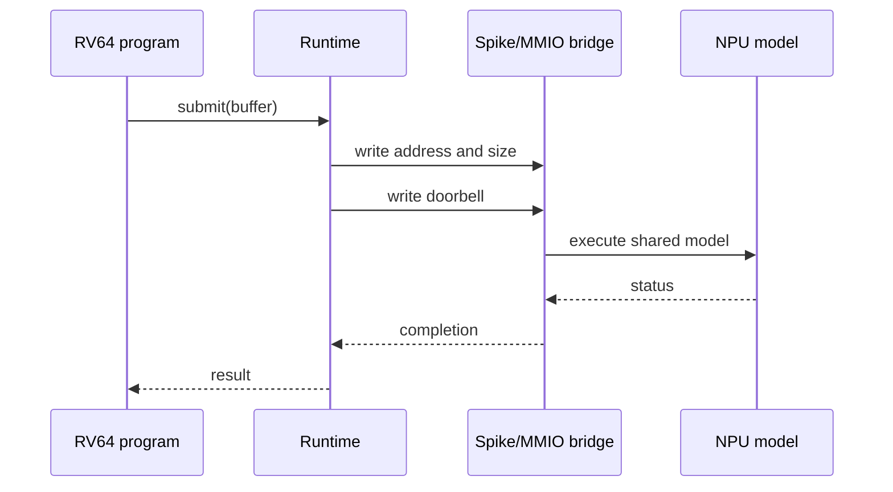

# Chapter 7: MMIO, RV64, and Spike

The runtime is intentionally thin. It prepares shared memory, writes submission
registers, rings the doorbell, waits for completion, and translates device
status into host-visible behavior.

## Learning goals

- identify what belongs in the runtime rather than the compiler or device;
- describe the MMIO submission sequence;
- explain how a Spike extension reaches the same functional model as native tests;
- recognize ordering and address-translation hazards.

## Runtime path

Native and Spike-hosted paths should differ only at the adapter boundary. That
keeps arithmetic and command interpretation from forking.

## Reading path

1. Read the [MMIO/runtime contract](../mmio-runtime.md).
2. Follow the [runtime and Spike lesson](../lessons/05-spike-runtime.md).
3. Review the interface hazards in [this chapter](review.md).
