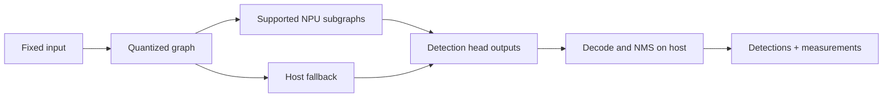

# Chapter 9: YOLOv8n deployment

YOLOv8n is the first application target because it exercises a realistic mix
of convolutional compute, graph transformation, memory planning, and host-side
post-processing while remaining small enough to study.

## Learning goals

- explain why the project fixes model variant, input shape, and batch size;
- partition detector work between the NPU and RISC-V host;
- define correctness gates for intermediate and final outputs;
- design measurements that separate compute, transfer, and fallback cost.

## Deployment boundary

Freezing the target makes comparisons interpretable. Shape or model changes
belong in a new experiment, not an undocumented rerun.

## Reading path

1. Understand the [target decision](../yolo-target.md).
2. Follow the [YOLOv8n deployment lesson](../lessons/07-yolov8n.md).
3. Review the application gates in [this chapter](review.md).

!!! warning "No benchmark claim yet"
    The documentation defines the experiment. It does not claim a detector
    result, accuracy figure, or speedup.
