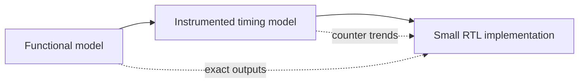

# Chapter 10: Timing and RTL

The functional model answers what the NPU computes. A timing model estimates
when work completes and why resources are idle. RTL then provides a more
detailed implementation comparison after the earlier contracts are stable.

## Learning goals

- separate functional correctness from cycle estimation;
- define utilization and traffic counters precisely;
- identify assumptions in a roofline-style estimate;
- understand the role of a small RTL comparison.

## Model ladder

Each model has a different purpose. Agreement should be judged against the
contract appropriate to that model, not by assuming identical internal events.

## Reading path

1. Work through the [performance and RTL lesson](../lessons/08-performance-rtl.md).
2. Revisit the [verification plan](../verification-plan.md).
3. Complete the [summary and review](review.md).

!!! note "Later milestone"
    No timing or RTL output is verified in the documentation-first release.
