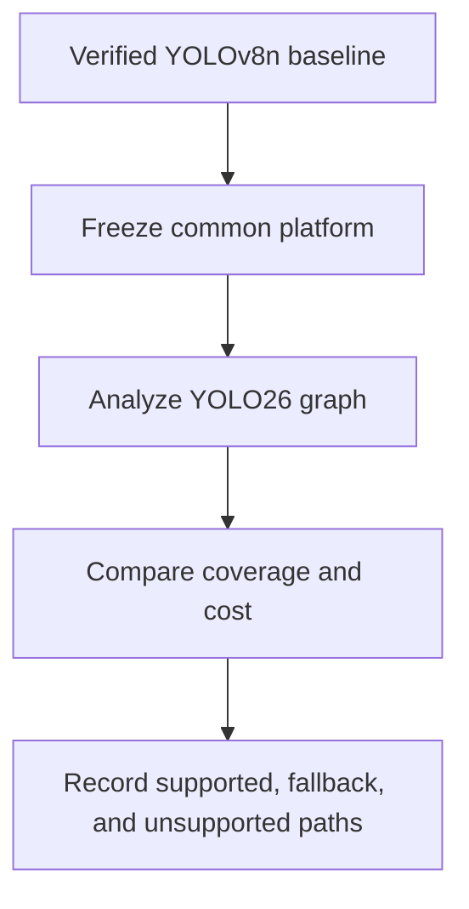

# Chapter 11: YOLO26 comparison

This chapter is a controlled comparison branch after the YOLOv8n path works.
It asks how a newer detector changes operator coverage, lowering decisions,
memory behavior, and performance assumptions.

## Learning goals

- hold the platform and evidence method constant while changing the model;
- identify new or changed operator requirements;
- separate architectural differences from implementation maturity;
- avoid replacing the primary milestone before it is complete.

## Comparison method

## Reading path

1. Complete the primary [YOLOv8n chapter](../chapter_09_yolo/index.md).
2. Follow the [YOLO26 comparison lesson](../lessons/09-yolo26n.md).
3. Use the [review](review.md) to check experimental fairness.

!!! warning "Gated branch"
    This track begins only after the common compiler/runtime stack and YOLOv8n
    evidence are available.
