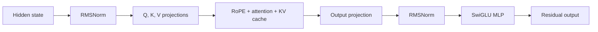

# Chapter 12: Transformer systems

The Transformer branch reuses GEMM, quantization, compilation, and runtime
foundations while adding sequence state and operators such as RMSNorm, RoPE,
attention, SwiGLU, and KV-cache access.

## Learning goals

- distinguish prefill from autoregressive decode;
- track tensor shapes through one decoder block;
- explain why KV-cache traffic changes the bottleneck;
- evaluate which operations map naturally to the existing NPU.

## Decoder-block view

## Reading path

1. Read the [Transformer capability track](../transformer-track.md).
2. Work through the [Transformer lesson](../lessons/10-transformer.md).
3. Complete the [summary and review](review.md).

!!! warning "Independent research branch"
    Transformer work must not delay the first YOLOv8n result.
