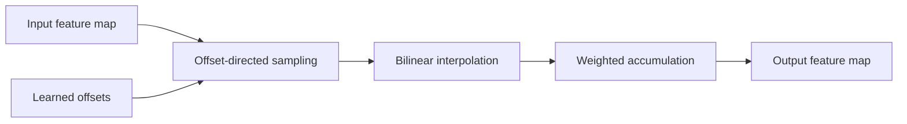

# Chapter 13: Deformable convolution

Deformable convolution is an irregular-memory study. Learned offsets change
where each sample is read, and bilinear interpolation replaces the regular
window access of ordinary convolution.

## Learning goals

- trace offset generation and sampling coordinates;
- explain bilinear interpolation and boundary handling;
- identify why irregular gathers stress a systolic-oriented design;
- compare fallback, lowering, and specialized hardware options.

## Data path

## Reading path

1. Study the [capability analysis](../deformable-convolution.md).
2. Follow the
   [deformable-convolution lesson](../lessons/11-deformable-conv.md).
3. Use the [review](review.md) to evaluate design options.

!!! warning "Independent research branch"
    This capability study does not block the regular convolution or YOLO path.
