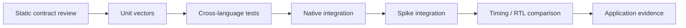

# Chapter 14: Verification and project method

Verification connects every claim to a named oracle and a repeatable gate.
This chapter also records the reorganization and reviews that turned the
repository into a readable, publishable book.

## Learning goals

- build a verification matrix across Python, C++, Spike, timing, and RTL;
- distinguish static review from executed validation;
- triage findings by severity and evidence;
- preserve project history without presenting plans as results.

## Verification ladder

## Reading path

1. Use the [verification plan](../verification-plan.md).
2. Follow the [executable milestone plan](../execution-plan.md).
3. Read the [logic review](../logic-review.md) and
   [static scaffold review](../scaffold-review.md).
4. Inspect the [reorganization plan](../project/reorganization-plan.md),
   [reorganization logic review](../project/reorganization-logic-review.md),
   [dated static code review](../project/static-code-review-2026-07-28.md),
   [static remediation review](../project/static-remediation-review-2026-07-28.md),
   [book content/logic review](../project/content-logic-review-2026-07-28.md),
   and [visual content review](../project/visual-content-review-2026-07-28.md).

!!! note "Current evidence boundary"
    Documentation navigation and build integrity may be verified on the host.
    Implementation correctness remains explicitly deferred to the WSL phase.
