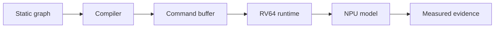

# Preface

This book follows one question from several angles: what must be made explicit
before a neural-network graph can run reproducibly on a small NPU attached to a
RISC-V host?

The answer is a stack of contracts. Numerical rules define exact tensor
behavior. An instruction stream describes work. A compiler lowers the graph.
A runtime submits commands. Functional, timing, and eventually RTL models
provide progressively stronger implementation evidence.

## What you will build

The first complete application target is a fixed-shape, INT8 YOLOv8n
deployment. Small arithmetic, GEMM, convolution, and tiny-CNN examples are
deliberate checkpoints on that route.

!!! warning "Documentation-first release"
    The contracts and teaching sequence are ready for review. The implementation
    has only received static inspection. Linux builds, Spike integration, and
    numerical experiments are deferred until the WSL environment is available.

## Reading routes

- New readers should continue with [How to read this book](../start-here.md).
- Implementers can use the [course map](../learning-path.md) as a checklist.
- Reviewers should begin with the
  [specification status](../specification-status.md) and
  [verification plan](../verification-plan.md).
