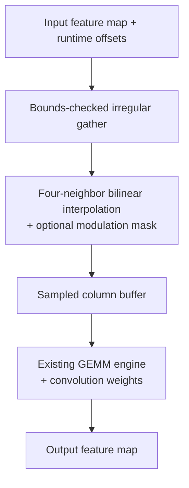
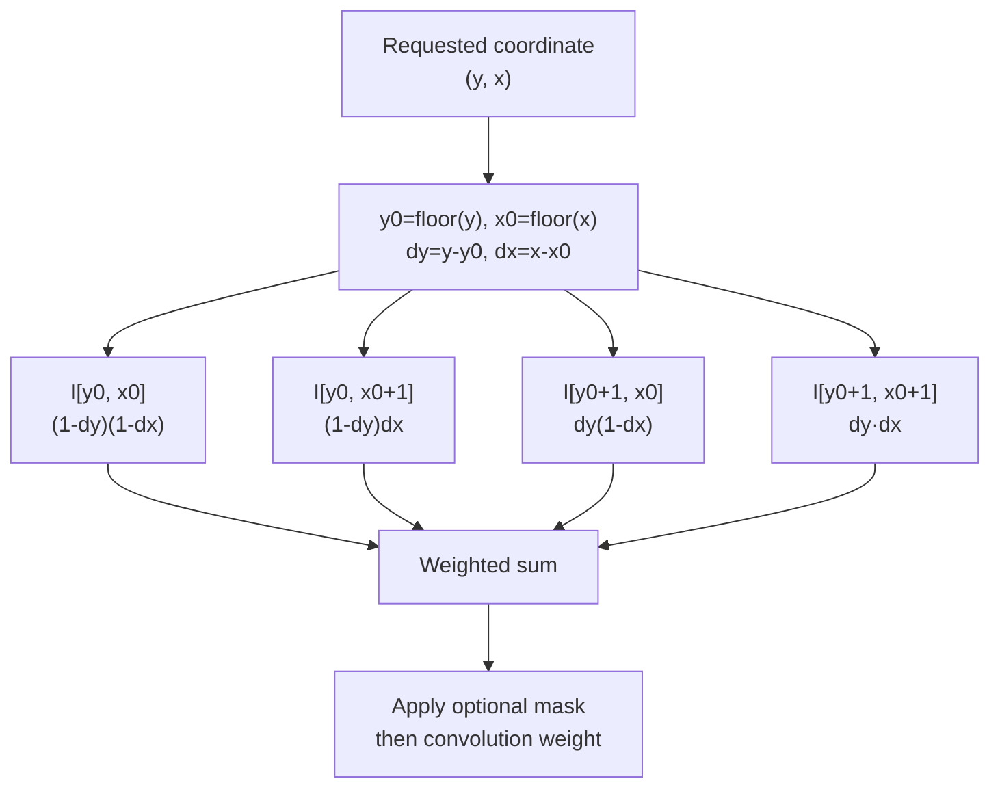

# Deformable convolution capability study

## Decision

Deformable convolution is a valuable advanced operator study, but it is not
required by the selected base YOLOv8n or YOLO26n models.

The first supported behavior will be a correct FP32 host fallback. The first
accelerator experiment will split the operator into:



Only after measuring this design should the project propose a streaming gather
engine.

## What changes from ordinary convolution

Regular convolution samples a fixed integer grid:

```text
input[y + ky, x + kx]
```

Deformable convolution predicts offsets and samples:

```text
input[y + ky + offset_y, x + kx + offset_x]
```

Offsets can be fractional, so a 2D sample normally requires bilinear
interpolation from four neighboring input positions. DCNv2 can also multiply
each sampled value by a learned modulation mask.

The ONNX DeformConv operator accepts:

- Input tensor
- Weight tensor
- Runtime offset tensor
- Optional bias
- Optional modulation mask

Current ONNX DeformConv type constraints are floating-point types rather than
an INT8 quantized operator contract.

One fractional sample is a weighted reduction of four neighboring pixels:



Each out-of-range neighbor contributes the specified padding value before the
weighted sum.

## Why it is difficult for a conventional NPU

### Data-dependent addresses

The sampling addresses are known only after the offset tensor is produced.
Static loop tiling cannot completely predict the actual input locations.

### Irregular gathers

Neighboring output points may read unrelated input positions. Bursts,
coalescing, cache lines, and scratchpad-bank mapping become less efficient.

### Four-neighbor interpolation

Each logical sample can require four bounds-checked loads, interpolation
weights, multiplies, and additions before the convolution weight is applied.

### Reduced reuse

Regular convolution reuses a predictable sliding window. Runtime offsets can
reduce or randomize that reuse.

### Additional tensors

Offsets and optional masks consume storage and bandwidth. A separate
convolution usually produces them.

### Quantization difficulty

Feature values, offsets, interpolation coefficients, masks, and accumulated
outputs can require different formats. Quantizing offsets changes sample
locations, not only sample values.

## Capability options

| Option | Advantage | Cost |
|---|---|---|
| RV64 host fallback | Simple and correct | Very slow; high transfer cost |
| Deformable-im2col + GEMM | Reuses existing MAC array | Large temporary buffer and traffic |
| Streaming gather front end | Avoids full column buffer | New address/interpolation hardware |
| General vector/gather unit | Reusable for other irregular ops | More complex ISA and memory system |
| Model rewrite to regular Conv | No hardware change | May require retraining and lose accuracy |

The project should implement and measure the first three rather than deciding
from intuition.

## Numerical contract

Specify:

- Coordinate convention
- Offset channel ordering
- Padding and out-of-range behavior
- Bilinear interpolation equation
- Accumulation precision
- Optional mask behavior
- Group and offset-group behavior
- NaN/Inf policy for malformed offsets

Use ONNX DeformConv as the semantic reference for the selected opset.

## Step-by-step experiment

### D0 — FP32 scalar reference

Implement a tiny 2D case with explicit loops and compare it with ONNX
Reference/Runtime or Torchvision.

### D1 — Zero offsets

With a mask of one, output must match regular convolution within floating-point
tolerance.

### D2 — Integer offsets

Test shifts, padding boundaries, negative offsets, and offset groups without
fractional interpolation.

### D3 — Fractional offsets

Add bilinear interpolation and hand-calculate very small examples.

### D4 — Modulation mask

Test zeros, ones, and fractional masks.

### D5 — Host fallback

Pass tensors through the runtime, execute the operator on the host model, and
account for all transfer and execution work.

### D6 — Gather-to-column-buffer

Materialize sampled values into a regular buffer, then invoke the existing
GEMM. Measure temporary bytes and memory traffic.

### D7 — Streaming gather engine

Model:

- Address-generation lanes
- Four read requests per fractional sample
- Bounds checks
- Interpolation arithmetic
- Scratchpad banks
- Request coalescing
- Backpressure into the MAC array

### D8 — Quantization study

Compare floating offsets with candidate fixed-point formats. Measure output
error and address/interpolation complexity before proposing an ABI.

## Correctness gate

- Zero-offset equivalence passes.
- Fractional samples match hand calculations.
- Out-of-range samples follow the specified zero-padding behavior.
- Optional mask behavior is tested.
- Host fallback and accelerator decomposition match the same reference.
- Irregular memory traffic is reported rather than counted as ordinary Conv.

## Primary references

- [Deformable Convolutional Networks](https://arxiv.org/abs/1703.06211)
- [Deformable ConvNets v2](https://arxiv.org/abs/1811.11168)
- [ONNX DeformConv specification](https://onnx.ai/onnx/operators/onnx__DeformConv.html)
- [Torchvision deformable-convolution operators](https://docs.pytorch.org/vision/main/ops)
