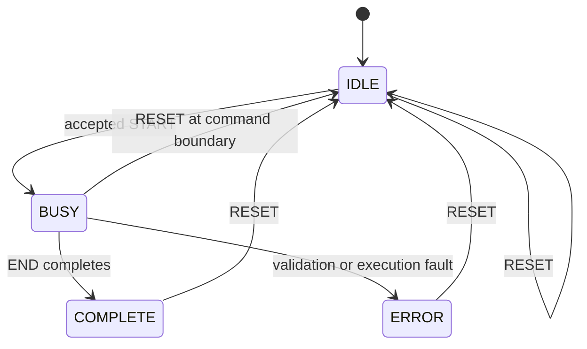

# MMIO and runtime contract

Status: **v1 normative design; implementation unverified**

This interface lets an RV64 program submit a command buffer to the functional
NPU. The same device model is called directly by the native runner.

## Version-one aperture

Version-one project decision:

```text
base address: 0x4000_0000
size:         0x0000_1000 (4 KiB)
access width: aligned 32-bit reads/writes
```

The exact base must also appear in the linker/platform configuration. It is
not discoverable in the first bare-metal version.

## Register map

| Offset | Name | Access | Meaning |
|---:|---|---|---|
| `0x000` | `VERSION` | R | Major in bits 31:16, minor in 15:0 |
| `0x004` | `CAPABILITIES` | R | Version-one feature bitmap |
| `0x008` | `CONTROL` | W | `START` bit 0, `RESET` bit 1 |
| `0x00c` | `STATUS` | R | `IDLE`, `BUSY`, `COMPLETE`, `ERROR` |
| `0x010` | `CMD_ADDR_LO` | RW idle | Guest address bits 31:0 |
| `0x014` | `CMD_ADDR_HI` | RW idle | Guest address bits 63:32 |
| `0x018` | `CMD_BYTES` | RW idle | Command-buffer byte count |
| `0x01c` | `ERROR_CODE` | R | Stable device error |
| `0x020` | `ERROR_COMMAND` | R | Failing command sequence |
| `0x024` | `COMMANDS_DONE` | R | Successfully completed count |
| `0x028` | `ARRAY_CONFIG` | R | Rows in 15:0, columns in 31:16 |
| `0x02c` | `SCRATCHPAD_BYTES` | R | Implemented scratchpad capacity |
| `0x030` | `MACS_LO` | R | 64-bit counter low word |
| `0x034` | `MACS_HI` | R | High word |
| `0x038` | `DRAM_READ_LO` | R | 64-bit counter low word |
| `0x03c` | `DRAM_READ_HI` | R | High word |
| `0x040` | `DRAM_WRITE_LO` | R | 64-bit counter low word |
| `0x044` | `DRAM_WRITE_HI` | R | High word |
| `0x048` | `EST_CYCLES_LO` | R | 64-bit counter low word |
| `0x04c` | `EST_CYCLES_HI` | R | High word |
| `0x050` | `COMMAND_ABI` | R | Accepted command major in 31:16, minor in 15:0 |
| `0x054` | `MAX_CMD_BYTES` | R | Maximum accepted command bytes |

Unlisted offsets, wrong-direction accesses, byte/halfword/64-bit accesses, and
unaligned accesses return a platform MMIO access fault and do not change device
state. The Spike adapter must translate that result into the platform's normal
guest access-fault behavior.

`CAPABILITIES` is a feature bitmap:

| Bit | Feature |
|---:|---|
| 0 | DMA load/store |
| 1 | INT8 x INT8 to INT32 GEMM |
| 2 | INT32 bias |
| 3 | INT32 ReLU |
| 4 | INT32-to-INT8 requantization |
| 5 | Barrier command |

Unassigned bits read as zero. The initial `ARRAY_CONFIG` value describes an
8x8 array, `SCRATCHPAD_BYTES` reads as 65,536, `COMMAND_ABI` reads as
`0x0001_0000`, and `MAX_CMD_BYTES` reads as 1,048,576.

`VERSION` versions this register/state-machine interface, not the serialized
command format. A runtime independently checks both `VERSION` and
`COMMAND_ABI`. Version one requires exact major/minor equality for both.

For 64-bit counters, reading the low word latches the high word until it is
read. This prevents torn values if a future asynchronous model updates a
counter during polling.

## Status encoding

Exactly one primary state bit is set:

| Bit | State |
|---:|---|
| 0 | `IDLE` |
| 1 | `BUSY` |
| 2 | `COMPLETE` |
| 3 | `ERROR` |



`COMPLETE` and `ERROR` remain visible until `RESET`. Version one requires an
explicit reset before another submission.

`CONTROL.START` is accepted only in `IDLE`. Once accepted, zero, misaligned,
too-large, or otherwise invalid command configuration transitions to device
`ERROR` with the corresponding stable code. Validation is externally visible
as `BUSY`; it is an internal substate, not a fifth status bit.
`CONTROL.RESET` is accepted in every state. Writing both bits, an unknown bit,
or `START` outside `IDLE` returns an MMIO access fault and leaves the current
state unchanged.

An accepted `START` with invalid command configuration or contents transitions
to `ERROR`. A valid submission transitions through `BUSY` to `COMPLETE`, unless
an execution fault transitions it to `ERROR`.

## Reset values

After power-on or an accepted reset:

| State | Value |
|---|---|
| `STATUS` | `IDLE` |
| `CMD_ADDR_LO/HI`, `CMD_BYTES` | Zero |
| `ERROR_CODE` | `0` |
| `ERROR_COMMAND` | `0xffff_ffff` |
| `COMMANDS_DONE` and all counters | Zero |
| Counter high-word latches | Cleared |
| Command snapshot | Empty |
| Scratchpad and initialization state | Cleared as defined by the memory model |

Reset from `BUSY` requests abort at the next command boundary. A command never
commits a partial destination. Reset then clears all state above before
returning to `IDLE`; aborted results are invalid.

## Submission sequence

The runtime performs:

```text
check ABI/device version
-> validate local pointers and command size
-> write all command/data bytes
-> fence memory before device I/O
-> write CMD_ADDR_LO/HI and CMD_BYTES
-> write CONTROL.START
-> poll STATUS with finite iteration/time limit
-> on ERROR, read ERROR_CODE and ERROR_COMMAND
-> on COMPLETE, fence device completion before reading result
-> read counters
```

Only the runtime library contains volatile register accesses. Workload code
calls a typed submission function.

## Runtime API sketch

```c
typedef struct {
  uint64_t macs;
  uint64_t dram_read_bytes;
  uint64_t dram_write_bytes;
  uint64_t estimated_cycles;
  uint32_t commands_done;
} npu_counters_t;

typedef struct {
  uint32_t code;
  uint32_t command;
} npu_error_t;

int npu_init(void);
int npu_reset(void);
int npu_submit(uint64_t command_guest_address, uint32_t command_bytes);
int npu_wait(
    uint32_t poll_limit,
    npu_counters_t* counters,
    npu_error_t* error);
int npu_read_counters(npu_counters_t* counters);
```

All functions return `0` on success and a negative runtime code on failure:

| Value | Name | Meaning |
|---:|---|---|
| `-1` | `NPU_RT_INVALID_ARGUMENT` | Null output, zero poll limit, or invalid local argument |
| `-2` | `NPU_RT_INCOMPATIBLE` | Register or command ABI version mismatch |
| `-3` | `NPU_RT_MMIO_FAULT` | Register access was rejected on a recoverable native/platform adapter |
| `-4` | `NPU_RT_TIMEOUT` | Poll limit reached while status remained `BUSY` |
| `-5` | `NPU_RT_DEVICE_ERROR` | Device reached `ERROR`; numeric device fields are returned |
| `-6` | `NPU_RT_BAD_STATE` | Runtime call order does not match device state |

Every function with an output structure zero-initializes it before any
operation. `npu_error_t.command` is initialized to `0xffff_ffff`.
`npu_init` reads `VERSION`, `COMMAND_ABI`, capabilities, array shape, limits,
and scratchpad size; it rejects incompatible values and finishes with
`npu_reset`.
`npu_submit` is nonblocking: it configures the registers and rings the
doorbell. `npu_wait` performs at most `poll_limit` status reads. A timeout does
not reset the device automatically; the caller records diagnostics and then
calls `npu_reset`.

A minimal bare-metal platform normally handles an invalid MMIO access as a
guest access-fault trap, so the offending C API call does not return `-3`.
`NPU_RT_MMIO_FAULT` is available only when the native harness or a later
platform supplies recoverable MMIO access callbacks. Raw invalid-access tests
run in a trap-aware harness rather than ordinary workload code.

## Memory ordering

The command and tensor writes must become visible before the doorbell. Result
and status observations must be ordered before the guest consumes output.

The exact RISC-V `fence` operands will be chosen and tested against the
platform's memory/I/O classification. Do not use a compiler barrier as a
substitute for an architectural fence.

The runtime exposes `npu_fence_before_start()` and
`npu_fence_after_completion()` as the only platform-specific ordering
functions. Freezing their instruction operands is an E5 platform decision and
cannot change the command or register ABI.

## Error classes

Stable device errors:

| Value | Name |
|---:|---|
| `0x0000` | `NONE` |
| `0x0001` | `START_CONFIG_INVALID` |
| `0x0002` | `COMMAND_TOO_LARGE` |
| `0x0100` | `BAD_MAGIC` |
| `0x0101` | `UNSUPPORTED_COMMAND_ABI` |
| `0x0102` | `BAD_HEADER_SIZE` |
| `0x0103` | `BAD_TOTAL_SIZE` |
| `0x0104` | `BAD_COMMAND_COUNT` |
| `0x0105` | `BAD_RECORD_SIZE` |
| `0x0106` | `BAD_SEQUENCE` |
| `0x0107` | `NONZERO_RESERVED` |
| `0x0108` | `UNKNOWN_OPCODE` |
| `0x0109` | `BAD_END` |
| `0x010a` | `TRAILING_OR_MISSING_BYTES` |
| `0x0200` | `GUEST_RANGE_INVALID` |
| `0x0201` | `SCRATCHPAD_RANGE_INVALID` |
| `0x0202` | `ALIGNMENT_INVALID` |
| `0x0203` | `OPERAND_OVERLAP` |
| `0x0204` | `UNINITIALIZED_SCRATCHPAD` |
| `0x0300` | `ZERO_LENGTH_DMA` |
| `0x0301` | `INVALID_DIMENSION` |
| `0x0302` | `INVALID_STRIDE` |
| `0x0303` | `INVALID_DTYPE` |
| `0x0304` | `INVALID_REQUANTIZATION` |
| `0x0400` | `DMA_READ_FAULT` |
| `0x0401` | `DMA_WRITE_FAULT` |

Logs may contain extra text, but tests compare numeric codes. Header and
submission errors set `ERROR_COMMAND=0xffff_ffff`; record-related errors set
the record's sequence number. If several rules are invalid, the validation
order in the command ABI selects one deterministic code.

Required error behavior:

- Zero/too-large command size
- Unmapped command address
- Invalid MMIO width/alignment/offset
- ABI validation error
- DMA range fault
- Poll timeout reported by runtime
- Reset from idle, complete, and error

`START` outside `IDLE` and invalid raw MMIO accesses are platform access faults,
not device `ERROR_CODE` values. This distinction prevents an illegal second
doorbell from aborting valid in-flight work.

## Counter accounting

Counters are zeroed at accepted `START` and reset. A command contributes only
after it completes successfully:

```text
DMA cycles = 4 + ceil(byte_count / 16)
GEMM cycles = ceil(M / 8) * ceil(N / 8) * (K + 14)
Bias cycles = ceil((rows * cols) / 8)
ReLU cycles = ceil(element_count / 8)
Requantize cycles = ceil(element_count / 8)
Barrier cycles = 1
End cycles = 1
```

`EST_CYCLES` is the sum for this serial v1 model. `MACS` adds `M*N*K`;
traffic counters add completed DMA payload bytes. Failed commands contribute
nothing. GEMM array utilization is reported in evidence, not a register:

```text
utilization = MACS / (64 * sum_of_GEMM_cycles)
```

These equations are project-defined analytical estimates, not hardware cycle
claims. Later timing models may add overlap and stalls under a new timing-model
version without changing functional results.

## Native adapter

The native runner supplies:

- A byte-addressed guest-memory image
- Checked read/write callbacks
- The same MMIO-facing submission configuration or a thin direct adapter

It must not use host pointers in serialized command bytes. Native and Spike
paths hash and execute the same buffer.

## Spike adapter

The Spike-specific layer owns:

- Registration of the 4 KiB MMIO aperture
- Translation of legal 32-bit accesses
- Guest physical-memory reads/writes
- Reset/tick integration
- Compatibility code for the pinned Spike revision

It does not own command parsing, numerical kernels, counters, or graph logic.

## Required proof sequence

1. Read `VERSION` and `CAPABILITIES`.
2. Read/write a scratch test register if one is temporarily implemented.
3. Verify invalid offset/width behavior.
4. Prove guest-memory copy with a known pattern.
5. Prove timeout/reset behavior.
6. Submit a buffer containing only `END`.
7. Submit the known MLP command buffer.
8. Compare output and counter hashes with the native runner.

## Primary references

- [Spike abstract device interface](https://github.com/riscv-software-src/riscv-isa-sim/blob/master/riscv/abstract_device.h)
- [Spike source and API warning](https://github.com/riscv-software-src/riscv-isa-sim)
- [RISC-V memory-ordering explanation](https://docs.riscv.org/reference/isa/unpriv/mm-eplan.html)

## Continue through the specification

Next specification: [Tiny compiler design](compiler-design.md)
