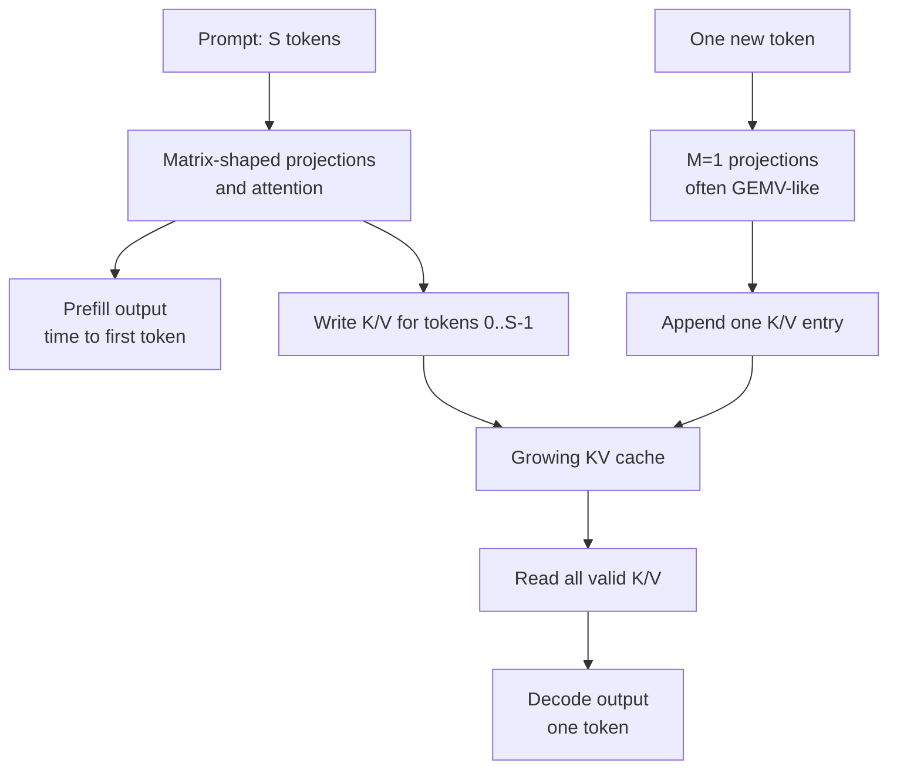
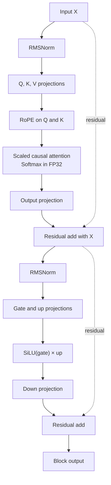

# Transformer and LLM capability track

## Decision

Transformer operations are important enough to include, but they do not belong
in the first YOLO milestone.

The correct learning target is:

> Execute one tiny Llama-style decoder block, first functionally and then with
> measured prefill and one-token decode paths.

Do not start with an 8B model. Model size, tokenizer integration, weight
loading, and generation infrastructure would obscure the accelerator lessons.

## Why the existing NPU still helps

Most Transformer parameters and arithmetic live in matrix operations:

- Q, K, and V projections
- Attention score `Q * K^T`
- Attention/value product `P * V`
- Attention output projection
- Feed-forward gate/up/down projections

The INT8 GEMM engine, tiler, scratchpad, DMA model, compiler, and command ABI
are therefore reusable.

## Why GEMM is not enough

A useful decoder block also needs:

- Batched MatMul
- Tensor reshape, transpose, split, and concat
- Scaling and causal masking
- Numerically stable Softmax
- RMSNorm or LayerNorm
- RoPE
- SiLU/SwiGLU and elementwise multiplication
- Residual addition
- KV-cache reads, writes, and dynamic valid length
- Mixed-precision conversion

Softmax and normalization are reductions with nonlinear functions. They often
need higher internal precision than INT8 linear layers. KV-cache access is a
memory-capacity and bandwidth problem, not a MAC problem.

## Prefill and decode are different workloads

### Prefill

The input contains many prompt tokens. Linear layers and attention use larger
matrix dimensions and can utilize the array well. Standard attention can
materialize a sequence-by-sequence score matrix, making memory traffic grow
quickly.

### Autoregressive decode

One new token is processed at a time. Many linear operations become GEMV-like
with `M=1`, which can underutilize a spatial array. Every layer reads weights,
and attention reads the growing KV cache. Decode can therefore become
bandwidth-bound even when the NPU has many MACs.

Performance reports must separate:

```text
prefill tokens/second
time to first token
decode tokens/second
bytes read per generated token
KV-cache bytes
```

The two paths reuse the same block but stress different resources:



## Proposed tiny block

Initial educational parameters:

| Parameter | Value |
|---|---:|
| Batch | 1 |
| Hidden size | 128 |
| Query heads | 4 |
| KV heads | 4 initially |
| Head dimension | 32 |
| Sequence lengths | 1, 16, 64 |
| FFN hidden size | 256 or 384 |
| Layers | 1 |
| Reference precision | FP32 |

After standard multi-head attention works, reduce KV heads to study grouped
query attention.

The first complete block keeps nonlinear and reduction operations explicit so
that each boundary can be compared independently:



## Operator mapping

| Operator | First implementation | Later NPU direction |
|---|---|---|
| Linear/MatMul | Existing GEMM | INT8/weight-quantized array |
| Batched MatMul | Lower to GEMM loop | Native batched scheduler |
| RMSNorm | FP32 host/reference | Reduction/vector unit |
| RoPE | Host elementwise | Vector lanes or lookup tables |
| Softmax | Stable FP32 host/reference | FP16/FP32 reduction/SFU |
| Causal mask | Compiler/host | Fused attention scheduler |
| SwiGLU | Host/vector reference | Elementwise/SFU |
| KV cache | Simulated DRAM | Dedicated layout/DMA policy |
| Residual Add | Existing elementwise path | Vector/activation unit |

Host fallback must appear in coverage and performance results.

## Precision plan

1. Implement the complete block in FP32 reference code.
2. Run MatMul through the existing INT8 path while keeping Softmax and RMSNorm
   in FP32.
3. Compare layer and block errors.
4. Evaluate FP16/BF16 for reductions and activations.
5. Study INT8 activation and INT8/INT4 weight formats only after the mixed path
   is correct.

Do not approximate `exp` or reciprocal square root before the stable
floating-point algorithm and error budget are documented.

## Attention memory plan

Begin with explicit attention:

```text
S = (Q * K^T) * scale
P = softmax(mask(S))
O = P * V
```

This makes every tensor inspectable. Then add an IO-aware tiled implementation
that avoids storing the full score/probability matrix by maintaining online
Softmax statistics. Compare its result, scratchpad use, and DRAM traffic with
the explicit implementation.

FlashAttention is a reference for the IO-aware principle; this project should
derive and test its own small educational implementation rather than claiming
FlashAttention compatibility.

## KV-cache plan

Model:

- Maximum sequence length
- Current valid length
- Per-layer K and V regions
- Head-major versus sequence-major layout
- Append writes
- Decode reads
- Grouped-query sharing
- Capacity and traffic

Required boundary tests:

- Empty cache
- First token
- Exact maximum length
- Overflow attempt
- Reset between sequences
- Different query and KV head counts

## Success criteria

- FP32 block matches a framework reference.
- Mixed INT8/FP32 block has documented error.
- Prefill and decode results are tested separately.
- KV-cache state is deterministic and bounds checked.
- Explicit and IO-aware attention agree within tolerance.
- Reports include MAC utilization and bytes per token.
- No claim is made about a full LLM from one-block results.

## Primary references

- [Attention Is All You Need](https://arxiv.org/abs/1706.03762)
- [FlashAttention](https://arxiv.org/abs/2205.14135)
- [ONNX Attention](https://onnx.ai/onnx/operators/onnx__Attention.html)
- [ONNX Softmax](https://onnx.ai/onnx/operators/onnx__Softmax.html)
- [ONNX RMSNormalization](https://onnx.ai/onnx/operators/onnx__RMSNormalization.html)
- [Meta Llama 3 model implementation](https://github.com/meta-llama/llama3/blob/main/llama/model.py)
- [Current Meta Llama models repository](https://github.com/meta-llama/llama-models)
- [Meta Llama 3 architecture overview](https://ai.meta.com/blog/meta-llama-3/)
- [ONNX Runtime quantization](https://onnxruntime.ai/docs/performance/model-optimizations/quantization.html)
