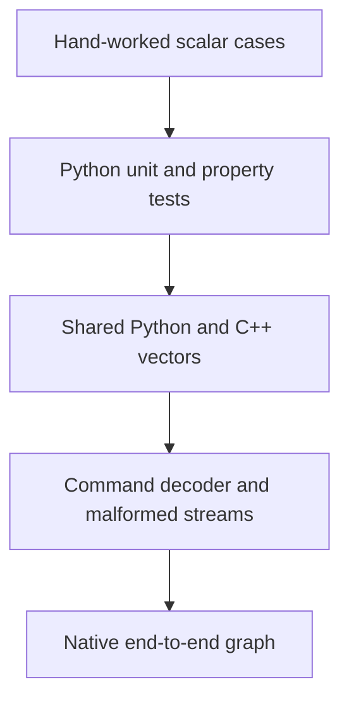
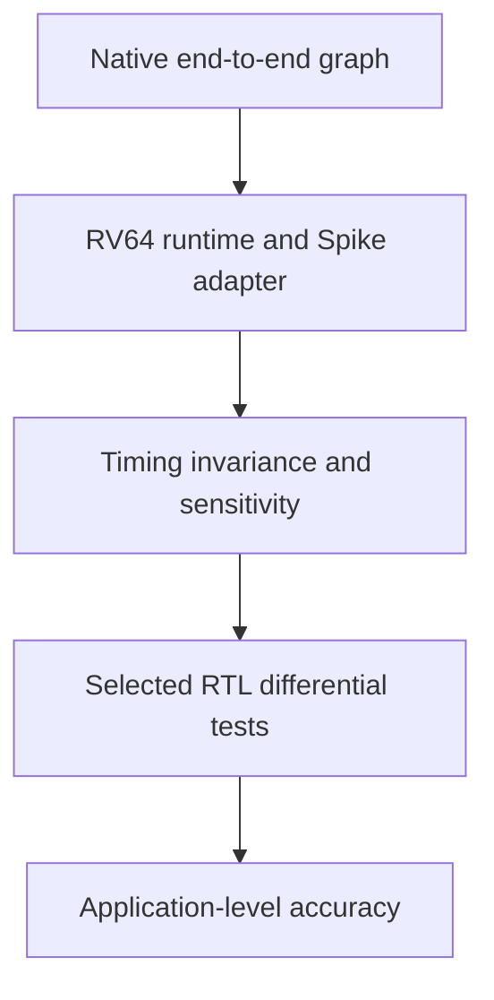

# Verification plan

Status: **documentation baseline; execution deferred**

This plan defines the evidence required to turn a documented component into a
verified one. No table entry below is a claim that a test has already run.

## Verification ladder



The native graph is the handoff to integration and higher-level evidence:



A failure is debugged at the first divergent boundary. Later agreement cannot
waive an earlier red gate.

## Contract-to-evidence matrix

| Contract | Primary oracle | Required evidence | Acceptance |
|---|---|---|---|
| Quantize/saturate | Hand-worked values | Boundaries, ties, non-finite/extreme rejection | Same values or stable error category |
| INT8 dot/GEMM | Python scalar reference | Shared fixed and seeded vectors, wrap cases | Exact INT32 bytes |
| Requantization | Integer quotient/remainder definition | Positive/negative ties, shift limits, clamps | Exact INT8 bytes |
| ABI encoding | Command ABI tables | Golden buffer, decode/re-encode, SHA-256 | Byte-identical round trip |
| ABI rejection | Stable error table | One named fixture per malformed rule, plus fuzzing | Same code and command index |
| Scratchpad safety | Memory/execution model | Range, alignment, initialization, overlap tests | No unchecked or partial access |
| Device state | MMIO/runtime contract | Every state/input transition and reset path | Exact status/register values |
| Compiler passes | Typed IR invariants | Golden pass dumps and rejection diagnostics | Deterministic artifacts |
| Allocation | Lifetime model | Property tests over interval sets | No live overlap; within 64 KiB |
| Native graph | Python graph evaluator | MLP layer hashes and first-divergence report | Exact final and intermediate bytes |
| Spike integration | Native runner | Same command/memory image under RV64 | Same output and counters |
| Timing separation | Functional model | Sweep timing parameters | Functional hash unchanged |
| Timing usefulness | Equations, then RTL | Sensitivity and selected-block correlation | Error reported, not assumed accurate |
| YOLO partition | Framework/ONNX baseline | Per-boundary error and operator coverage | Fixed threshold defined before run |

## Required test classes

### Named examples

Small cases appear in test names and documentation. They include zero, extrema,
positive and negative ties, one-element matrices, maximum legal strides, and
the smallest invalid range.

### Shared differential vectors

One generator creates versioned fixtures consumed without reinterpretation by
Python and C++. The manifest records seed, generator revision, schema version,
case count, and SHA-256. Random tests supplement named cases; they do not
replace them.

### Property and metamorphic tests

Examples:

- Re-encoding a valid decoded command stream preserves every byte.
- Renaming graph tensors does not change numerical output.
- Changing legal scratchpad offsets changes addresses but not tensor values.
- Splitting a mathematically valid GEMM into tiles preserves output.
- Changing timing parameters preserves all functional state.
- Reset followed by the same submission reproduces the same output/counters.

### Negative and adversarial tests

Malformed commands cover truncated records, integer overflow, unknown values,
reserved bits, invalid strides, range overlap, uninitialized reads, and adapter
faults. A coverage-guided fuzzer targets the decoder and semantic validator
after deterministic fixtures pass.

### Cross-layer tests

At each boundary, save:

```text
artifact version
input hash
output hash
shape/dtype/layout
first differing element or byte
expected and observed value
producer command/IR operation
```

The MLP gate compares after GEMM, bias, ReLU, requantization, store, and final
runtime completion—not only the final class scores.

## State-machine coverage

The device test matrix includes:

- Reset from `IDLE`, `BUSY`, `COMPLETE`, and `ERROR`
- Start with missing, zero, misaligned, unmapped, and oversized command buffer
- Start from every non-idle state
- Valid `END`-only and multi-command submissions
- Structural validation failure before mutation
- Semantic validation failure before mutation
- DMA failure after earlier successful commands
- Counter low/high latch behavior
- Poll timeout as a runtime error distinct from a device error
- Repeated reset and deterministic resubmission

Every register is tested for legal read/write behavior, illegal width,
unaligned offset, write masking, and reset value.

## Compiler coverage

Each pass has an independently inspectable input and output:

| Pass | Positive proof | Rejection proof |
|---|---|---|
| Parse | Canonical graph accepted | Unknown/missing/duplicate fields |
| Shape inference | MLP shapes inferred | Rank and dimension mismatch |
| Lowering | Linear becomes GEMM+bias | Unsupported op or quantization |
| Lifetime | Expected birth/death table | Missing producer/cycle |
| Allocation | Deterministic placement | Capacity/size overflow |
| Scheduling | Dependencies initialized before use | Read-before-write |
| Encoding | Golden command bytes | Unrepresentable field |
| Disassembly | Stable readable text | Malformed record diagnostics |

Compilation failure leaves no partially published artifact set. Outputs are
written to a temporary staging directory and renamed into place only after all
passes succeed.

## Tool-assisted checks when execution resumes

- Python type/lint/test tools defined by the pinned project configuration
- C++ warnings-as-errors for project code
- AddressSanitizer and UndefinedBehaviorSanitizer
- Decoder fuzzing with a saved regression corpus
- Static analysis focused on unchecked arithmetic and lifetime errors
- Documentation/link check on every change
- CI matrix for every environment the repository claims to support

These tools provide evidence about an implementation; their presence alone is
not a passed gate.

## Evidence manifest

Every executed gate writes a machine-readable manifest containing:

```json
{
  "milestone": "E2",
  "status": "pass-or-fail",
  "git_revision": "full SHA or disclosed working tree",
  "started_utc": "ISO-8601",
  "environment": {},
  "commands": [],
  "seeds": [],
  "input_hashes": {},
  "output_hashes": {},
  "tests": {},
  "failures": []
}
```

Human-readable progress posts summarize this evidence without replacing it.

## Acceptance rule

A milestone becomes **verified** only when:

1. Its focused gate passes from a clean checkout.
2. All earlier gates remain green.
3. Required artifacts and manifests exist.
4. No unexplained differential mismatch remains.
5. Documentation describes observed behavior, versions, and limitations.

Until then its status remains documented, reviewed, scaffolded, or executed.

## Continue through the specification

Next specification: [Executable milestone plan](execution-plan.md)
